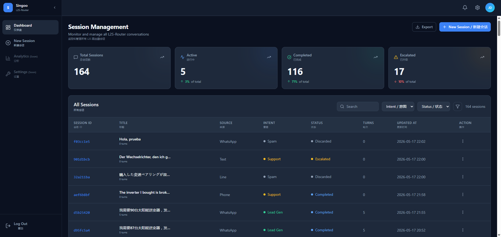
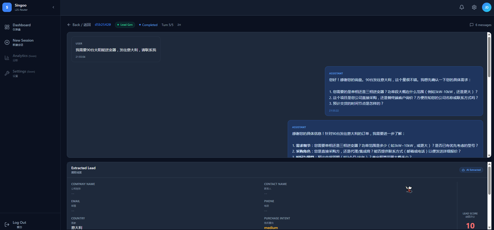

# Singoo L2S-Router

**Multi-agent B2B lead-to-sale orchestrator. / B2B 多智能体线索到成交编排器。**

AI-powered social inquiry triage, RAG-based sales engagement, and structured CRM lead extraction. Built on LangGraph and DeepSeek.

---

## Screenshots / 截图

### Session List Dashboard / 会话列表仪表盘



### Conversation View / 对话详情



---

## Quick Start / 快速开始

```bash
# Clone and install / 克隆并安装
git clone https://github.com/JadeKy1in/singoo-l2s-router.git
cd singoo-l2s-router
pip install -r requirements.txt

# Configure / 配置
cp .env.example .env
# Edit .env — set your LLM API key and model names

# Start backend / 启动后端
python -m uvicorn app:app --host 127.0.0.1 --port 8000 --reload

# Start frontend (separate terminal / 另一个终端)
cd frontend
npm install
npm run dev
```

Open `http://localhost:5173` for the management dashboard. / 打开 `http://localhost:5173` 进入管理面板。

---

## How to Use / 使用说明

### Mock Mode (fast, free) / Mock 模式（快速、免费）

Set in `.env`: `SINGOO_MOCK_MODE=true`

All AI responses are instant templates. No API calls, no cost. Ideal for UI development and workflow testing. / 所有 AI 回复均为即时模板，零 API 调用，零成本。适合 UI 开发和工作流测试。

### Real LLM Mode / 真实 LLM 模式

Set in `.env`: `SINGOO_MOCK_MODE=false`

Configure your DeepSeek (or OpenAI-compatible) endpoint:

```env
SINGOO_LLM_BASE_URL=https://api.deepseek.com/v1
SINGOO_LLM_API_KEY=sk-your-key-here
SINGOO_ROUTER_MODEL=deepseek-v4-flash      # Fast model for intent classification
SINGOO_SALES_MODEL=deepseek-v4-flash       # Sales conversation (flash recommended)
SINGOO_EXTRACTOR_MODEL=deepseek-v4-flash   # CRM data extraction
```

**Model selection tips / 模型选择建议：**
- `deepseek-v4-flash` — fast, cheap, good enough for testing
- `deepseek-v4-pro` — slower reasoning model, better quality but costs more. If using pro for sales, expect ~5-10s per conversation turn (5 turns × 5-10s = 25-50s per session).
- Any OpenAI-compatible endpoint works — just change `SINGOO_LLM_BASE_URL`.

### Creating Sessions / 创建会话

1. Open `http://localhost:5173` — the Session List dashboard
2. Click **New Session / 新建会话** (top-right button)
3. Enter a **Lead Source** (default: WhatsApp) and an **Initial Inquiry** message
4. Click **Create / 创建**

Examples to try / 测试示例：
- `我需要50台太阳能逆变器，发往德国，请联系我` → Lead Gen → shows sales conversation + lead data card
- `我买的逆变器坏了，需要维修` → Support → shows escalated status + human reply box
- `hello test random message` → Spam → discarded

### Reviewing & Exporting Leads / 审核与导出线索

1. Click any session row to view the full conversation
2. Scroll down to see the **Extracted Lead** card with all CRM fields
3. Review the lead score and missing BANT fields
4. Click **Export to CRM / 导出至 CRM** to send lead data to your CRM webhook

### Human Reply for Escalated Sessions / 人工回复转接会话

When a session shows `Escalated` status (amber badge):
1. Open the session — a reply box appears below the conversation
2. Type your response and click **Send Reply**
3. The session completes and the reply is recorded

### CLI Commands / 命令行

```bash
python -m singoo test                  # Run all tests / 运行全部测试
python -m singoo stats                 # Session statistics / 会话统计
python -m singoo export-all            # Dry-run lead export / 线索导出预演
python -m singoo export-all --execute  # Export to CRM webhook / 导出至 CRM
```

Note: `python -m singoo serve` works **from the parent directory** (`projects/`). If you're inside the `singoo/` directory, use `python -m uvicorn app:app` instead. / 注意：`python -m singoo serve` 需在**父目录**（`projects/`）下执行。如果已在 `singoo/` 目录内，请使用 `python -m uvicorn app:app`。

---

## Architecture / 架构

```
+---------------------------------------------+
|  Frontend / 前端                               |
|  React + TypeScript + Vite + Tailwind CSS     |
|  src/pages/ — SessionList, ConversationView,  |
|              NewThread                        |
+-------------------+-------------------------+
                    | JSON over HTTP
+-------------------v-------------------------+
|  FastAPI (app.py)                           |
|  api/handlers.py — business logic / 业务逻辑 |
|  api/models.py  — request/response models   |
+-------------------+-------------------------+
                    |
+-------------------v-------------------------+
|  LangGraph StateGraph (graph/workflow.py)    |
|                                               |
|  START → router → sales → ... → extractor → END |
|             |        |
|             +- Support → escalate → END (wait human)
|             +- Spam → discard → END
+-------------------+-------------------------+
                    |
+-------------------v-------------------------+
|  Agents (agents/)                            |
|  RouterAgent    — intent + language detection |
|  SalesAgent     — RAG-powered multi-turn sales |
|  ExtractorAgent — CRM extraction + BANT scoring |
+-------------------+-------------------------+
                    |
+-------------------v-------------------------+
|  Storage (storage/)                          |
|  ThreadStore (JSON) / SqliteStore            |
|  KnowledgeBase (ChromaDB)                    |
+---------------------------------------------+
```

### Key Design Decisions / 核心设计决策

- **API-First / API 优先.** The backend exposes a JSON REST API. The React frontend is a standalone SPA that consumes it — replace with Vue, mobile app, or any HTTP client.
- **Full pipeline in one call.** Each `POST /thread` runs the complete workflow (intent → sales turns → extraction) and returns the result. No polling needed.
- **BANT score correction.** The LLM assigns a base lead score; deterministic code deducts weights for each missing BANT field (Budget: -10, Authority: -8, Need: -8, Timeline: -8, Contact: -10). Minimum score floor: 10.
- **Language-aware.** The router detects Chinese, Arabic, Spanish, etc. via CJK/Arabic regex. The sales agent uses localized prompts to reply in the customer's language.
- **Storage abstraction.** `ThreadStore` interface with swappable JSON and SQLite backends via `SINGOO_STORE_BACKEND`.

### LLM vs Deterministic Code

| LLM Handles (Semantic) | Code Handles (Structural) |
|---|---|
| Intent classification | Graph routing logic |
| Sales conversation + RAG | BANT score correction formula |
| CRM field extraction | Language detection (CJK/Arabic regex) |
| Conversation-complete signal | Empty reply guard |
| Natural language understanding | Retry with exponential backoff |

---

## API Endpoints / API 端点

| Method | Path | Purpose / 用途 |
|--------|------|----------------|
| `POST` | `/thread` | Create thread + full pipeline / 创建会话并完成全流程 |
| `POST` | `/thread/{id}/reply` | Continue conversation / 继续对话 |
| `POST` | `/thread/{id}/human-reply` | Human agent responds to escalation / 人工回复转接 |
| `POST` | `/thread/{id}/export` | Export lead to CRM webhook / 导出线索至 CRM |
| `GET` | `/threads` | List all sessions / 会话列表 |
| `GET` | `/thread/{id}` | Full thread detail + transcript / 会话详情 |
| `GET` | `/threads/pending-export` | Unexported leads / 待导出线索 |
| `GET` | `/health` | Health check / 健康检查 |

---

## Project Structure / 项目结构

```
singoo/
├── README.md
├── .env                         # API keys and model config
├── .env.example
├── requirements.txt
├── Dockerfile
├── docker-compose.yml
│
├── app.py                       # FastAPI entry point
├── auth.py                      # Bearer token middleware
├── __main__.py                  # CLI entry
│
├── frontend/                    # React SPA (standalone)
│   └── src/
│       ├── pages/               # SessionList, ConversationView, NewThread
│       ├── components/          # UI, layout, dashboard components
│       ├── api/client.ts        # API client functions
│       ├── types/index.ts       # TypeScript interfaces
│       └── hooks/useApi.ts      # Generic fetch hook
│
├── api/
│   ├── handlers.py              # Business logic
│   └── models.py                # Pydantic models
│
├── agents/
│   ├── router.py                # Intent classification + language detection
│   ├── sales.py                 # RAG-powered multi-turn sales
│   ├── extractor.py             # CRM extraction + BANT correction
│   ├── llm_client.py            # Async HTTP client with retry
│   └── prompts.py               # Prompt templates (EN + ZH)
│
├── graph/
│   └── workflow.py              # LangGraph StateGraph pipeline
│
├── rag/
│   └── knowledge_base.py        # ChromaDB vector store
│
├── schemas/
│   ├── state.py                 # ThreadState, Message, ExtractedLead
│   └── enums.py                 # IntentType, ThreadStatus, AgentType
│
├── storage/
│   ├── thread_store.py          # JSON file persistence
│   └── sqlite_store.py          # SQLite persistence
│
├── config/
│   └── settings.py              # Pydantic BaseSettings (SINGOO_ prefix)
│
├── data/
│   ├── threads/                 # JSON thread files
│   └── knowledge/               # RAG knowledge documents
│
└── tests/                       # 89 tests in 13 files
```

---

## Configuration / 配置

All settings use the `SINGOO_` environment variable prefix. Set them in `.env`.

| Variable | Default | Description |
|---|---|---|
| `SINGOO_MOCK_MODE` | `true` | Skip LLM calls (fast, free testing) |
| `SINGOO_ROUTER_MODEL` | `mock` | Intent classification model |
| `SINGOO_SALES_MODEL` | `mock` | Sales conversation model |
| `SINGOO_EXTRACTOR_MODEL` | `mock` | CRM extraction model |
| `SINGOO_LLM_BASE_URL` | `http://localhost:8000/v1` | LLM API base URL |
| `SINGOO_LLM_API_KEY` | (empty) | LLM API key |
| `SINGOO_HOST` | `127.0.0.1` | Server bind address |
| `SINGOO_PORT` | `8000` | Server port |
| `SINGOO_MAX_TURNS` | `5` | Max conversation turns |
| `SINGOO_STORE_BACKEND` | `json` | `json` or `sqlite` |
| `SINGOO_API_AUTH_TOKEN` | (empty) | Bearer token for `/thread*` routes |
| `SINGOO_CRM_WEBHOOK_URL` | (empty) | Lead export webhook URL |

---

## Development / 开发

```bash
# Backend tests / 后端测试
python -m pytest tests/ -v

# Frontend build / 前端构建
cd frontend
npm run build

# Frontend dev server / 前端开发
npm run dev
```

### Docker

```bash
docker-compose up -d
```

---

## Credits / 致谢

Built with Claude Code, May 2026. 89 tests. React SPA + FastAPI backend.
